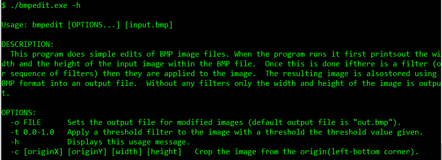
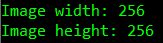
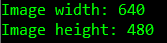

# Assignnment 1 

* Name : Liyang(Leon) Guan  

* Uni ID : u5684206  

## Summary of program's functionalities  

* Display the help message  
* Print out the width and height of an image  
* Apply a threshold filter  
* Crop the image  

## How to compile or run  

#### 1. Compile  

* $ gcc -Wall -o bmpedit bmpedit.c  
OR  
* $ make bmpedit (if there is a Makefile in the same directory)  

#### 2. Run  

(The order of the list corresponds to the summary of functionalities)  
* $ ./bmpedit -h  
* $ ./bmpedit [file]  
    e.g. $ ./bmpedit cup.bmp  
* $ ./bmpedit -t [thredhold value] -o [output_file]   
    e.g. $ ./bmpedit -t 0.5 -o cupth.bmp OR $ ./bmpedit -t 0.5 (by default output file is out.bmp)  
* $ ./bmpedit -c [originX] [originY] [width] [height] -o [output_file]    
    e.g. $ ./bmpedit -c 100 100 100 100 -o crop.bmp OR $ ./bmpedit -c 100 100 100 100 (by default output file is out.bmp)  

## Testing  

#### 1. help message
  

#### 2. print out width and height  
  
__It is the actual size of ["water.bmp"](img/water.bmp).__    
  
  
__It is the actual size of ["cup.bmp"](cup.bmp).__  

#### 3. apply a threshold  
* apply to ["cup.bmp"](cup.bmp) I get ["cup_threshold.bmp"](img/cup_threshold.bmp)  
* apply to ["water.bmp"](img/water.bmp) I get ["water_threshold.bmp"](img/water_threshold.bmp)  
* In order to test the padding size is correct:    
    1. apply to an image of 101x100 (padding size == 1) ["101.bmp"](img/101.bmp) I get ["101_threshold.bmp"](img/101_threshold.bmp)  
    2. apply to an image of 102x100 (padding size == 2) ["102.bmp"](img/102.bmp) I get ["102_threshold.bmp"](img/102_threshold.bmp)  
    3. apply to an image of 103x100 (padding size == 3) ["103.bmp"](img/103.bmp) I get ["103_threshold.bmp"](img/103_threshold.bmp)  
    
    
#### 4. crop the image  
* apply a 200x300 cropping to ["cup.bmp"](cup.bmp) I get ["cup_cropped.bmp"](img/cup_cropped.bmp)  
* apply a 100x100 cropping to ["water.bmp"](img/water.bmp) I get ["water_cropped.bmp"](img/water_cropped.bmp)  
* in order to test the padding size is correct (original image: ["102.bmp"](img/102.bmp)):  
    1. crop a 41x50 image (padding size == 1) ["102_cropped1.bmp"](img/102_cropped1.bmp)  
    2. crop a 42x50 image (padding size == 2) ["102_cropped2.bmp"](img/102_cropped2.bmp)  
    3. crop a 43x50 image (padding size == 3) ["102_cropped3.bmp"](img/102_cropped3.bmp)  
    

## What makes my extensions deserve a higher mark  
* The extension part is neat and clean.   
* I took a straightforward approach with an adequate amount of comments.   
* It worked for different padding sizes.  
* It throws error message if the input values are illegal.  

## Limitations and Improvements  
* I used an int indicator to go through the image file. If the image file is bigger than the MAXIMUM value of an int, then my program might not work properly. Maybe I can dynamically allocate another int variable if the current one has reached its limit next time.  
* I used high level abstractive functions like fwrite() and fopen(). Next time, I will try to use low level system calls like open() and write() to make the program more unix-based when handling files.  
* I did not handle most of the user input errors in this program. I will definitely improve the error handling issue next time.  
  
   
   

